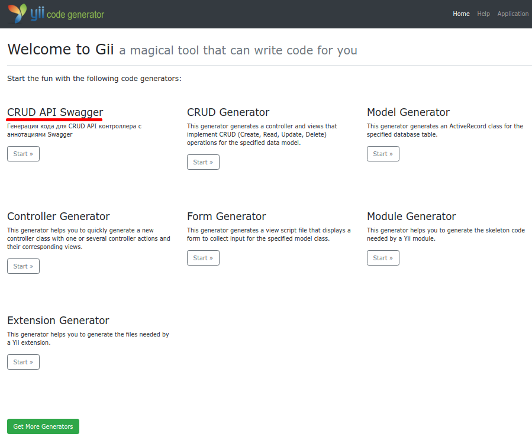
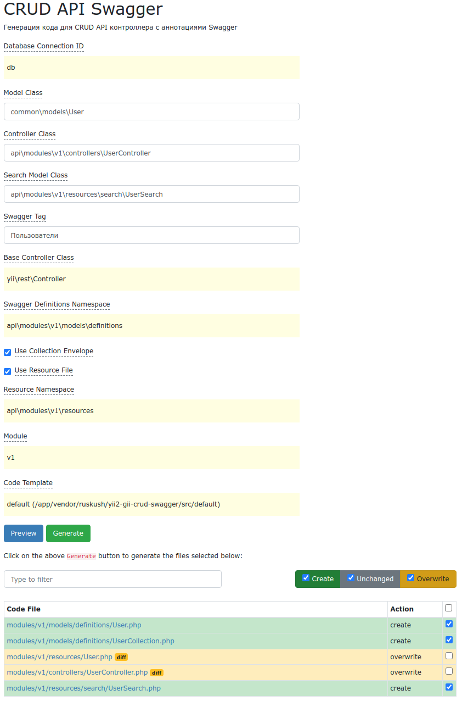

# Yii2 CRUD API Generator with Swagger
Расширение для yii2-gii - генератор CRUD для АПИ с аннотациями Swagger. Генерирует файл контроллера со встроенными 
CRUD-экшенами Yii2, с добавлением аннотаций Swagger для описания полей моделей, параметров фильтрации, пагинации (на 
основе схемы существующей таблицы БД); генерируются search-модель, файл ресурса и definition-файлы для Swagger.
## Установка расширения

Установка с помощью composer. Командой добавляем репозиторий: 
```shell
composer config repositories.gii-crud-swagger vcs https://github.com/ruskush/yii2-gii-crud-swagger
```
Либо вручную добавляем репозиторий в файл в composer.json:
```
{
//  ...
  "repositories": [
    {
      "type": "vcs",
      "url": "https://github.com/ruskush/yii2-gii-crud-swagger"
    }
  ],
//  ...
}
```
Устанавливаем библиотеку:
```shell
composer require ruskush/yii2-gii-crud-swagger:*
```
## Настройка приложения
После установки расширения необходимо настроить модуль gii в конфигурационном файле:
```php
if (YII_ENV_DEV) {
    $config['bootstrap'][] = 'gii';
    $config['modules']['gii'] = [
        'class' => yii\gii\Module::class,
        'generators' => [
            'swagger' => [
                'class' => \ruskush\giiCrudSwagger\Generator::class,
            ],
        ],
    ];
}
```
После этого на странице gii установленное расширение появится в списке генераторов:

Интерфейс генератора:
